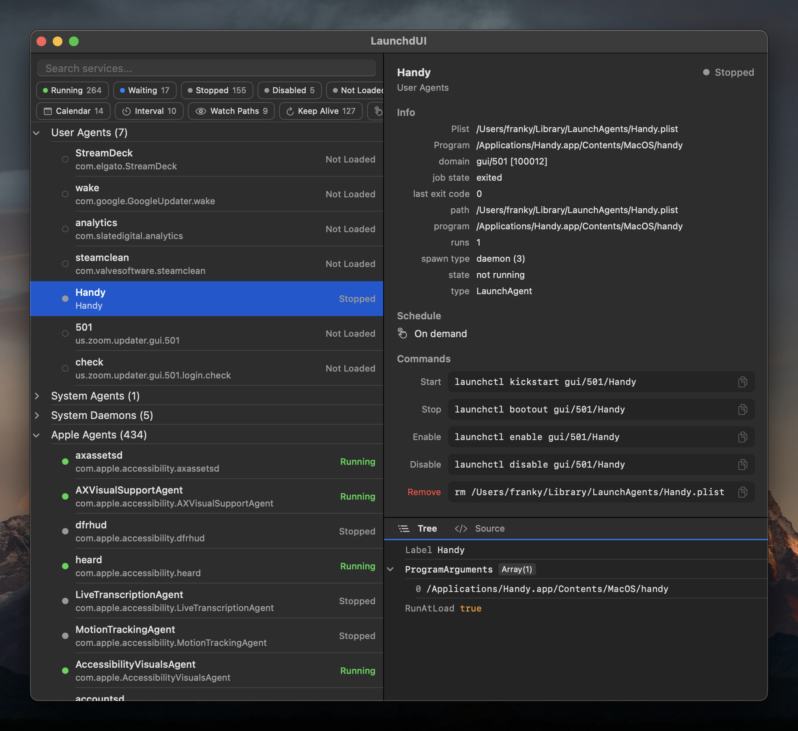

# LaunchdUI

A native macOS app for browsing and inspecting `launchd` services. Built with SwiftUI, Swift 6 strict concurrency, targeting macOS 15+.



## Features

- **Browse all launchd services** — User Agents, System Agents, System Daemons, Apple Agents, Apple Daemons
- **Live status indicators** — Running (green), Waiting (blue), Stopped (gray), Error (red), Killed (orange), Disabled, Not Loaded
- **Search & filter** — Filter by text, status, and schedule type with multi-select chip filters
- **Service details** — Plist path, program, arguments, PID, schedule, and runtime metadata from `launchctl print`
- **Plist inspector** — Tree view with expandable nodes and syntax-highlighted XML source view
- **Copyable commands** — Ready-to-paste `launchctl` commands for start, stop, enable, disable, and remove
- **Refresh** — Auto-refreshes on window focus, or manually with Cmd+R

## Strictly Read-Only

LaunchdUI never executes mutating `launchctl` commands. It only reads service data from plist files and `launchctl list` / `print` / `print-disabled`. Actionable commands are displayed as copyable strings for the user to run in their own terminal.

## Prerequisites

- macOS 15 (Sequoia) or later
- Swift 6.0+ (included with Xcode 16+)

## Build & Run

```bash
# Run directly
swift run LaunchdUI

# Build a standalone .app bundle
./scripts/bundle.sh
open .build/release/LaunchdUI.app
```

## Test

```bash
swift test
```

## Architecture

- **Models** — `LaunchdService`, `ServiceStatus`, `ServiceSchedule`, `ServiceSource`, `PlistValue` (recursive Sendable enum)
- **Parsers** — Pure static functions for `launchctl list`, `print-disabled`, and `print` output
- **Services** — `ServiceRepository` (actor), `LaunchctlClient`, `PlistReader`, `CommandGenerator`
- **UI** — `AppState` (@Observable), split-view layout with sidebar list and detail panel

Built as a Swift Package with no Xcode project required.
